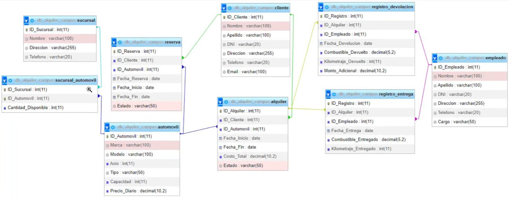
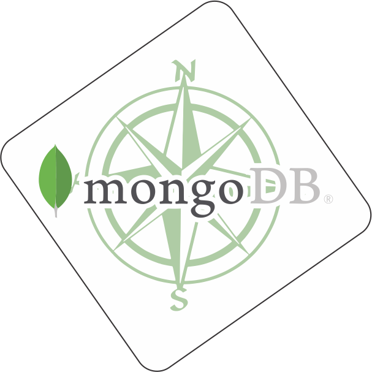
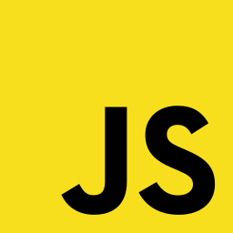
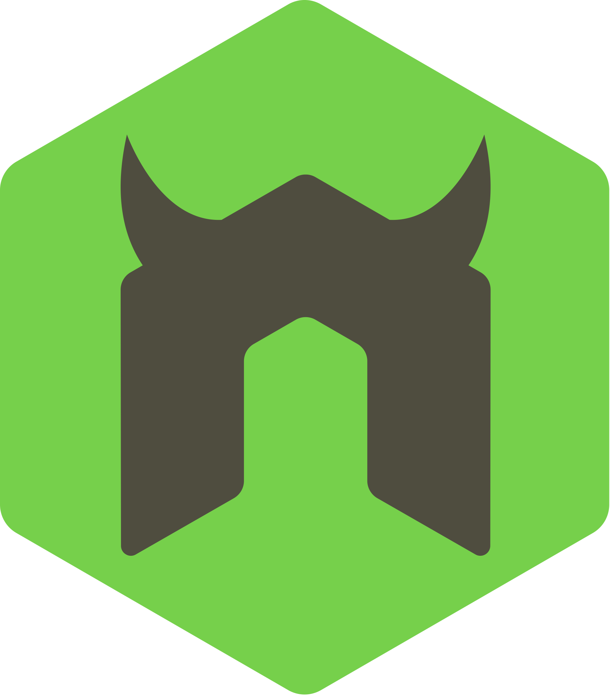

# CONSULTAS MongoDB

En este Taller estamos Generando una Base de Datos apartir de la imagen suministrada,
dando paso a la generacion de ciertas consultas especificadas en el siguiente documento

[PDF DOCUMENTO ALQUILER DE AUTOS](docs/Alquiler_de_Autos.pdf)

# DISEÑO BASE DE DATOS



# DEPENDENCIAS IMPLEMENTADAS

```JSON
    "class-transformer": "0.5.1",
    "class-validator": "0.14.0",
    "cookie-parser": "1.4.6",
    "dotenv": "16.3.1",
    "express": "4.18.2",
    "express-query-boolean": "2.0.0",
    "express-rate-limit": "6.8.1",
    "express-session": "1.17.3",
    "jose": "4.14.4",
    "mongodb": "5.7.0",
    "nodemon": "3.0.1",
    "reflect-metadata": "0.1.13",
    "typescript": "5.1.6"
```

# IMPLEMENTACION PROYECTO

### CLONACION DEL REPOSITORIO

Clonamos el repositorio con visual estudio code y lo guardamos en una carpeta de nuestra elección

```
https://github.com/JoseCabrejoVillarCampus/mongoAlquiler
```

### INSTALACION DE DEPENDENCIAS

Para Usar las Dependencias que estan en el package.json :
```
npm install
```

# CONFIGURACION DEL .env

Dentro de la Ruta que creamos para alojar el proyecto buscamos  el  archivo llamado ".env.example" y lo cambiamos por ".env"
En el archivo .env, configurar las siguientes variables de conexión a la base de datos:
```
MY_SERVER={"hostname":"","port":""}
ATLAS_USER=""
ATLAS_PASSWORD=""
ATLAS_DB=""
JWT_PRIVATE_KEY=""
```
En el campo de MY_SERVER ingrese un hostname y un puerto a su elección(preferiblemente mayor al 5000). Recuerde que por defecto el local host requiere que el hostname es 127.0.0.1. pero puede ser,
ATLAS_USER es el usuario de la base de datos registrado en Atlas y ATLAS_PASSWORD es la contraseña que le asignamos, ATLAS_DB es el nombre de la base de datos y el JWT_PRIVATE_KEY es la palabra secreta que usaremos para generar los tokens de JWT


# INICIAR nodemon

```
npm run dev
```

# SI SE REQUIERE HACER CAMBIOS EN EL DTO O CREAR LOS CONTROLADORES NUEVAMENTE,  DEBES INICIAR tsc

En una consola diferente a la que iniciamos el dev. El sigueitne comando iniciara el transpilador. En caso de borra la carpteta de los controladores este se creara nuevamente con el nombre que se le asigno en el tsconfig.json

```
npm run tsc
```
# INSTALACION BASE DE DATOS

Teniendo una cuenta en MongoDB Atlas, ya registrado indicado en la documentacion
https://github.com/JoseCabrejoVillarCampus/mongoDocumentacion

Nos dirigimos la la carpeta db, aca observaremos que para crear las colleciones, hemos realizado esquemas para la verificacion de tipo y patrones de datos


Procedemos a ejecutarlo uno por uno, en este caso hemos puesto la creacion de la collecion y la insecion de datos para cada una seguidamente, vasta con seleccionar la coleccion y dar en el boton "RUN" alojado en la esquina derecha superior


Diseño para la insercion de varios Datos para la tabla correspondiente, la ejecutamos de forma igual a la creacion de la coleccion


# GENERACION DE TOKEN DE ACCESO

En esta ocacion, hemos generado un token de acceso unico para cada tabla, basandonos en su esquema, este codigo lo podemos observar dentro de la carpeta **limit**, en el archivo **token.js**

Generar Token de acceso 

- Generación: Una vez dentro del cliente que estemos usando,("En este caso estamos ejecutando en thunderClient"), a traves
del metodo GET

```
http://${config.hostname}:${config.port}/token/"endpointtokentabla"
```

Donde "endpointtokentabla" es el nombre asignado para la generacion de cada tabla y son los siguientes:

```js

        'sucursal': Para la coleccion sucursal,
        'alquiler': Para la coleccion alquiler,
        'automovil': Para la coleccion automovil,
        'empleado': Para la coleccion empleado,
        'reserva': Para la coleccion reserva,
        'cliente': Para la coleccion cliente,
        'sucuautomovil': Para la coleccion sucursal_automovil,
        'regisdevo': Para la coleccion registro_devolucion,
        'regisent': Para la coleccion registro_entrega,

```


Utilización: El endPoint anterior es el que va a generar el token. Tome ese token (solo el valor, sin comillas ni corchetes) y dirijase al apartado de HEADERS, agrege el header/Autorization y en el valor ingrese el token suministrado anteriormente.


Este token tiene un limite de tiempo, en ese rango de tiempo podremos acceder a las rutas y endPoints de nuestra Api. Una vez pasada esta hora será necesario generar uno nuevo.


# CONSULTAS


## FUNCIONAMIENTO Y ENDPOINTS.


**CRUD DE LAS COLECCIONES**
Los siguiente endPoints corresponden a los CRUDs de cada coleccion, **es importante recordar que para realizar los metodos devimos generar anteriormente el token para cada uno y autorizarlo**.
Para estos endPoints se pueden realizar las consultas básicas, get, get by id, post, put y delete. La entrada de los datos está encriptada usando JWT. Además se cuenta con un middleware que permite la validación de los datos antes de que ingresen para evitar consumir recursos innecesarios y evitar problemas con el ingreso de la data en la base de datos.  

* EndPoint CRUD de la Tabla db_campus_alquiler:
Estos funciona  para POST/ GET/ DELETE/ PUT/,dentro del cliente que deseemos usar

* EndPoint CRUD de la Tabla alquiler: 
  *http://${config.hostname}:${config.port}/alquiler*

* EndPoint CRUD de la Tabla sucursal: 
  *http://${config.hostname}:${config.port}/sucursal*

* EndPoint CRUD de la Tabla automovil:
  *http://${config.hostname}:${config.port}/automovil*

* EndPoint CRUD de la Tabla cliente: 
  *http://${config.hostname}:${config.port}/cliente*

* EndPoint CRUD de la Tabla empleado:
  *http://${config.hostname}:${config.port}/empleado*

* EndPoint CRUD de la Tabla reserva: 
  *http://${config.hostname}:${config.port}/reserva*

* EndPoint CRUD de la Tabla registro_devolucion: 
  *http://${config.hostname}:${config.port}/registro_devolucion*

* EndPoint CRUD de la Tabla registro_entrega: 
  *http://${config.hostname}:${config.port}/registro_entrega*

* EndPoint CRUD de la Tabla sucursal_automovil: 
  *http://${config.hostname}:${config.port}/sucursal_automovil*


- Para la tabla sucursal tenemos le siguiente ejemplo:


## Metodo GET para todas las colecciones

El metodo **GET** para todas las tablas es el mismo del endpoint,pero si deseamos buscar por ID, si cambia algo la ruta, ya que nos es necesario adicionar un "/" seguido del id que desamos buscar

Ejemplo:

*http://${config.hostname}:${config.port}/sucursal/2*

en este caso estamos buscando dentro de la coleccion alquiler, el id especifico 2, que corresponde a nuestro "ID_Sucursal", creado en los esquemeas


## Metodo POST para todas las colecciones

El metodo **POST** funciona igual en todas las colecciones, en la misma url del metodo get,
dependiendo si la Base de Datos tiene el Id **opcional**, este parametro dentro del body puede ser 
opcional. 
El body es donde vamos a hacer la insersion de datos y contiene los campos de la coleccion, para cada coleccion el body 
varia, ademas es importante saber que en la insercion de daatos usaremos los alias que establecimos en el **dto** de cada coleccion y no los que tenemos propios en nuestra base de datos por eso es importante tener presente los campos que corresponden a esta.

EJEMPLO:


## Metodo PUT para todas las colecciones

El metodo put funciona igual en todas las colecciones, en la misma url del metodo colecciones/id,
este parametro id dentro del body se omite. 
El body es donde vamos a hacer la insersion de datos y contiene los campos de la coleccion, para cada coleccion el body 
varia, ademas es importante saber que en la insercion de daatos usaremos los alias que establecimos en el **dto** de cada coleccion y no los que tenemos propios en nuestra base de datos por eso es importante tener presente los campos que corresponden a esta.

EJEMPLO:


## Metodo DELETE para todas las colecciones

El metodo delete funciona igual en todas las colecciones, en la misma url colecciones/id,
aunque en este metodo lo unico que necesitamos es esta url para efectuarlo, sin necesidad de body

EJEMPLO:


---

# ALGUNOS OPERADORES USADOS

## $or

The $or operator performs a logical OR operation on an array of one or more <expressions> and selects the documents that satisfy at least one of the <expressions>. The $or has the following syntax:

```js
    { $or: [ { <expression1> }, { <expression2> }, ... , { <expressionN> } ] }
```

## $and

performs a logical AND operation on an array of one or more expressions (<expression1>, <expression2>, and so on) and selects the documents that satisfy all the expressions.

```js
    { $and: [ { <expression1> }, { <expression2> } , ... , { <expressionN> } ] }
```

## $eq

Specifies equality condition. The $eq operator matches documents where the value of a field equals the specified value.

```js
    { <field>: { $eq: <value> } }
```

## $gt

selects those documents where the value of the field is greater than (i.e. >) the specified value.

```js
    { field: { $gt: value } }
```

## $gte

selects the documents where the value of the field is greater than or equal to (i.e. >=) a specified value (e.g. value.).

```js
    { field: { $gte: value } }
```

## $lt

selects the documents where the value of the field is less than (i.e. <) the specified value.

```js
    { field: { $lt: value } }
```

## $lte

selects the documents where the value of the field is less than or equal to (i.e. <=) the specified value.

```js
    { field: { $lte: value } }
```

## $exists

When <boolean> is true, $exists matches the documents that contain the field, including documents where the field value is null. If <boolean> is false, the query returns only the documents that do not contain the field

```js
    { field: { $exists: <boolean> } }
```

# TECNOLOGIAS USADAS

<div>






</div>

# EXTENSIONES USADAS

MongoDB for VS Code

### Autor : Jose Alberto Cabrejo Villar